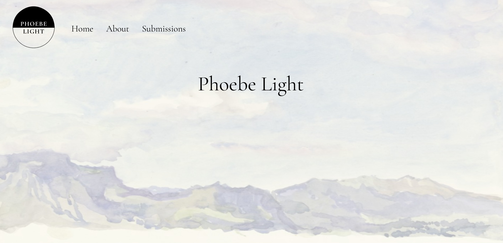

# PHOEBE LIGHT

## Description
Phoebe Light is a journal of poetry, poetics, criticism, and adjacent ventures. It takes its name from the great Alice Notley’s poem “Phoebe Light.”

## Quick Links
* **Project planning** can be found [here](https://trello.com/b/KrCNLzfd/phoebe-light).
* **Wireframe** can be found [here](https://lucid.app/lucidchart/86f46595-27da-4aae-a5ac-cbf7aa88d83e/edit?viewport_loc=-1583%2C-400%2C2068%2C1037%2C0_0&invitationId=inv_5674133a-e5da-4791-8481-acbaf4e691f6).
* **GitHub repo** can be found [here](https://github.com/annamiriams/phoebe-light).
* **Deployed project** link can be found [here](https://phoebelight-275a2da8eb1d.herokuapp.com/).

## Table of Contents
* [Technologies Used](#technologiesused)
* [Features](#features)
* [Design](#design)
* [Project Next Steps](#nextsteps)
* [About the Team](#team)
* [Works Cited](#workscited)

## Technologies Used
* Python
* HTML
* CSS
* Django
* CKEditor-5
* PostgreSQL

## Design
Phoebe Light aims to combine the aesthetics of online poetry journals with the functionality of a submission manager. Examples of the latter such as [Submission Manager](https://www.submissionmanager.net/), are typically clunky, unappealing, and expensive. Several contemporary online poetry journals served as inspiration including [Apartment Poetry Quarterly](http://www.aptpoetry.com/issue19/index.html), [Afternoon Visitor](https://www.afternoonvisitor.com/), and [Mercury Firs](https://www.mercuryfirs.org/).

## Project Next Steps
* Develop mobile-friendly version
* Develop UI for Admin for additional customization and submission/issue management
* Allow users to submit a PDF
* Incorporate email confirmation upon user submission and approval status response
* Build author pages to allow users to view all published pieces by any author
* Build user/author profiles to update/delete profile if needed

## About The Team
* [Anna Steckel](https://www.linkedin.com/in/annasteckel/) is the full-stack developer behind Phoebe Light. When not staring at a computer screen, Anna can be found birding.  
* [Adie Steckel](https://adiebsteckel.com/) is a writer and editor. They developed the concept for this app and supported its design and user experience. 

## Works Cited:
* **[Build a Blog From Scratch With Django](https://realpython.com/build-a-blog-from-scratch-django/)**: This provided a helpful walkthrough for building a blog using Django, which was a helpful foundation to have read through while building Phoebe Light.
* **[Django Project Structure](https://medium.com/django-unleashed/django-project-structure-a-comprehensive-guide-4b2ddbf2b6b8)**: Helpful to better understand Django project structure and file organization to keep code DRY. [This link](https://www.geeksforgeeks.org/best-practice-for-django-project-working-directory-structure/) was also useful.
* **[get_context_data](https://docs.djangoproject.com/en/5.2/topics/class-based-views/generic-display/)**: While buidling the Submissions page, I wanted to include both the ability to create a new submission and render a list of previous submissions on the page. ChatGPT suggested I look into get_context_data. Per the docs, get_context_data "returns context data for displaying the object" and I used it accordingly to display details of a user's submissions object.  
* **[related_name](https://docs.djangoproject.com/en/5.2/ref/models/fields/)**: In rendering both Issue and Submission model data on the home page, I found that using related_name ("the name to use for the reverse filter name from the target model") would allow me to do just that.
* **[CKEditor-5](https://www.youtube.com/watch?v=yHjoQirJNAQ)**: I wanted to incorporate a Rich Text Editor for authors to customize the styling of their submissions. After initially following a guide for CKEditor, I learned through a terminal warning that the original is no longer supported. I then found the linked video which guided me through installing and setting up the newest version of CKEditor-5. Written guides can be found [here](https://www.jaimedcsilva.com/hello-world/installing-ckeditor-with-django-part-1/) for part 1, and [here](https://www.jaimedcsilva.com/hello-world/installing-ckeditor-with-django-part-2/) for part 2.
* **[CSS custom properties](https://developer.mozilla.org/en-US/docs/Web/CSS/CSS_cascading_variables/Using_CSS_custom_properties)**: I only started learning about custom CSS styling using variables while trying to custom style the Rich Text Editor to match the styling of the app. [The EKEditor Docs](https://ckeditor.com/docs/ckeditor5/latest/framework/deep-dive/ui/theme-customization.html) provide a styling guide for the editor itself which uses custom properties. I used their example as a foundation for learning and to style the editor used in this app. 
* **[TemplateView](https://medium.com/@hellenwain_54279/django-class-based-views-templateview-fc44807297ed)**: I was struggling to determine how best to set up the view for the author-detail page. After a few ChatGPT prompts, I landed on using TemplateView since it allows flexibility when rendering data from multiple models. The linked article gave a great description and example that guided the process of writing the view itself. 
* **[ChatGPT](https://chatgpt.com/)**: Ultimately there were certain questions throughout the project where I turned to ChatGPT. I used is as a secondary resource to googling, though I ultimately turned to ChatGPT when I needed a more specific answer to understand the fundamentals of the concepts behind building a Python/Django app. For example, I found myself struggling with aspects of the styling of this app. For example, I asked ChatGPT for help with adjusting the background color of form fields specifically because I was struggling to understand why my styling was applying to certain fields correctly, but not others. By submitting a prompt that asked for help understanding what could get in the way of CSS styling, specifically in a log in page, I learned that Chrome styling overrides other styling when using any autofill function. 